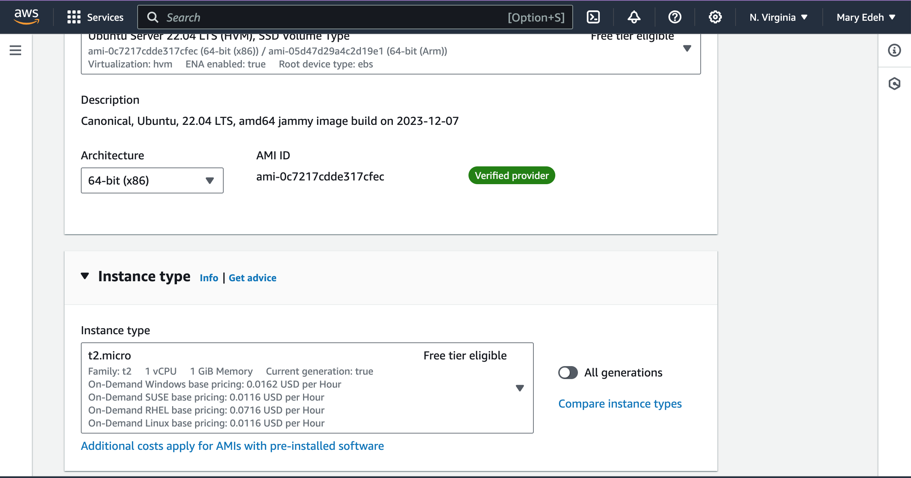

# How-to-Create-an-EC2-Instance-on-AWS

The Cloud is an insteresting place, as companies move to the cloud there is need to provision virtual machines. One of the most use cloud provider in the world is Amazon Web Services (AWS). 

**Introduction:**

Amazon Elastic Compute Cloud (EC2) is a web service that provides resizable compute capacity in the cloud. It allows you to easily set up virtual machines (instances) tailored to your specific needs.

**Step one: Create an account or Sign in to your AWS Management Console.**

To complete this task, we will need to create an account on the AWS console. [HERE](https://aws.amazon.com/console)
Create an account if you do not have any, then sign in with your account credentials.

**Step Two: Access the EC2 Daashboard.**

Once you loggin, locate the "Service" button and navigated to EC2 and you will be directed to the EC2 dashboard.

**Step Three: Launch Instance.**

On the EC2 Dashboard, click the "Launch Instance" button to initiate the process of creating a new EC2 instance.

**Step Four: Name your Instance.**

  

Choose a name that is unique to you and easily relateable to the project you are working on.

**Step 4: Choose an Amazon Machine Image (AMI).**

Select the AMI that best suits your requirements. An AMI is a template that contains the software configuration (e.g., operating system, application server) for your instance.

  

**Step 5: Choose an Instance Type.**

Next, choose an instance type based on the computing resources (CPU, memory, storage) you need.
 

**Step 6: Select Key Pair.**

A key pair is required to connect to your instance securely. If you don't have an existing key pair, you can create a new one. Download the private key file (.pem) and keep it secure.

 

 

**Step 7: Network Setting.**

Click on create a new security group, and it will automatically create a security group if you do not have an existing one.

 

**Step 8: Cofigure Storage.**

Leave this section as default.

 

**Step 9: Summary and Launch.**

Check that all you requirement is set and then your instance is ready to launch.

 

**Step 13: Access Your Instance.**

Once the instance is launched, you can access it using SSH (for Linux instances) or Remote Desktop (for Windows instances) using the private key file (.pem) you downloaded earlier.

**Conclusion:**

Creating an EC2 instance on AWS is a straightforward process that allows you to quickly deploy virtual servers in the cloud. By following this step-by-step guide, you can create and configure an EC2 instance tailored to your specific needs.
